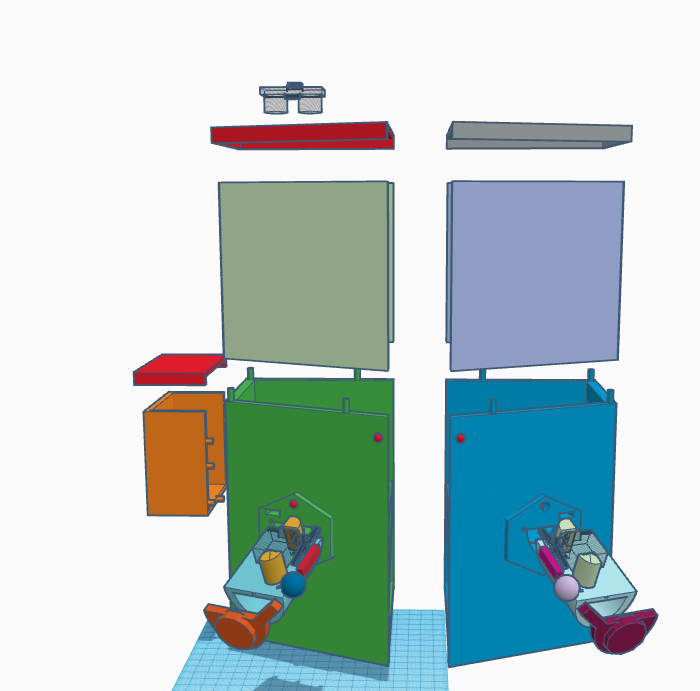

# 3D Files For Printer
[ThinkerCad Project](https://www.tinkercad.com/things/awMFhk7VWcj-catopew-3d-print)

## .OBJ Pieces
This folder contains all the .obj files to be printed in a 3D Printer.
The files are separated by pieces.

* CircuitBox
* CircuitBoxCover
* Left_Base
* Left_BaseExtender
* Left_Cover
* Left_Dispenser
* Left_DispenserCover
* Left_DispenserCoverConnector
* Left_EngineSlot
* Left_EngineToCverConnector
* Right_Base
* Right_BaseExtender
* Right_Cover
* Right_Dispenser
* Right_DispenserCover
* Right_DispenserCoverConnector
* Right_EngineSlot
* Right_EngineToCverConnector
