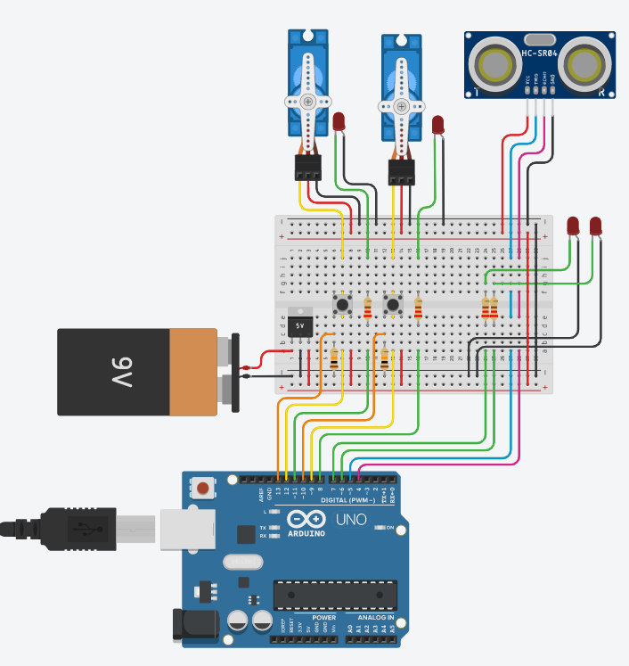

#SCHEMATICS

[ThinkerCad Schematics](https://www.tinkercad.com/things/fStgDfUvrxs-catopew-feeder-circuit)

This Thinkercad schmatics use a ARDUINO UNO because it haven't the NODE MCU component to be used

## Components List

* 1x Node MCU 8266
* 2x Servo Motor
* 4x Cathod Leds
* 4x 330 Ω resistor
* 2x Push Buttons
* 2x 10k Ω resistors
* 1x Ultrassonic sensor (HC-SR04)
* 1x 9v battery connector
* 1x 9v battery
* 1x LM7805
